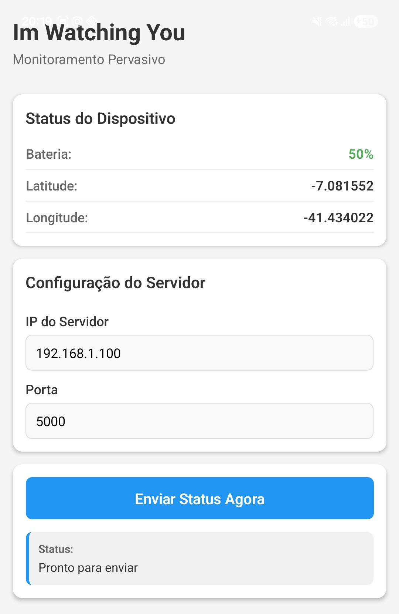

# ImWatchingYou 📱👁️ 

Um aplicativo móvel desenvolvido com [Expo](https://expo.dev) e React Native para *Monitoramento Pervasivo*. O app atua como um nó sensor que coleta dados de bateria e localização GPS do dispositivo Android e os envia via socket TCP para um servidor central em Python.

##  Objetivo da Atividade

**Atividade 2 – Monitoramento Pervasivo (Android → Servidor Python por Sockets)**

O aplicativo coleta em tempo real:
- **Nível de bateria atual** (%)
- **Coordenadas GPS** (Latitude e Longitude)

Estes dados são enviados via conexão TCP socket para um servidor Python central, permitindo monitoramento pervasivo do dispositivo.

##  Instalação

1. Clone o repositório:
   ```bash
   git clone <https://github.com/Hermeson69/ImWatchingYou.git>
   cd ImWatchingYou
   ```
   

2. Instale as dependências do app:
   ```bash
   npm install
   ```

##  Como executar o app (Android)

### Usando Expo Go (Recomendado para desenvolvimento rápido)

1. Inicie o servidor de desenvolvimento:
   ```bash
   npx expo start
   ```

2. No terminal, pressione `a` para abrir no Android ou escaneie o QR code com o app Expo Go no seu dispositivo Android.


##  Estrutura do Projeto

```
ImWatchingYou/
├── app/                          # Páginas do app (file-based routing)
│   ├── _layout.tsx              # Layout principal do app
│   └── index.tsx                # Página inicial com interface de envio
├── assets/                       # Recursos estáticos
│   └── images/                  # Imagens do app
├── app.json                      # Configurações do Expo
├── package.json                  # Dependências e scripts
├── tsconfig.json                 # Configurações do TypeScript
├── metro.config.js               # Configurações do Metro bundler
├── eslint.config.js              # Configurações do ESLint
└── README.md                     # Este arquivo
```

### Descrição das pastas principais:

- **app/**:Contém as telas/páginas do aplicativo. Usa o sistema de roteamento baseado em arquivos do expo-router.
  - _layout.tsx: Define o layout global do app (navegação, headers, etc.)
  - index.tsx: Página inicial com campos para IP/Porta e botão de envio

- **assets/**:Armazena imagens, ícones e outros recursos estáticos do app.

##  Tecnologias Utilizadas

- React Native + TypeScript
- Expo SDK 54
- `expo-battery` — leitura do nível de bateria
- `expo-location` — GPS em tempo real
- `react-native-tcp-socket` — conexão TCP com o servidor
- Expo Router v6 — navegação

---

## Servidor Python (Back-End)

O app depende de um servidor Python rodando na mesma rede. Sem ele, o envio de dados não funciona.

Repositório do servidor: [Raildom/Back-End-servidor-socket](https://github.com/Raildom/Back-End-servidor-socket.git)

```bash
cd Back-End-servidor-socket
python main.py
```

Saída esperada:

```
=======================================================
  [SERVIDOR] MONITORAMENTO PERVASIVO
=======================================================
  Host: 192.168.1.53
  Porta: 5000
=======================================================

  Aguardando dados dos sensores...
```

> Antes de usar o app, confirme que o servidor está rodando e anote o IP exibido — você vai precisar dele no app.

---

##  Protocolo de Comunicação

O app envia uma string de texto puro via TCP no seguinte formato:

```
bateria:85;lat:-23.5505;lon:-46.6333;timestamp:2026-03-27T12:00:00.000Z
```

O servidor responde com:

```
OK: Dados recebidos com sucesso!
```

Ambos os dispositivos precisam estar na **mesma rede Wi-Fi**.

---

##  Permissões Android

Declaradas em `app.json` e solicitadas em tempo de execução:

| Permissão | Finalidade |
|---|---|
| `INTERNET` | Comunicação TCP com o servidor |
| `ACCESS_FINE_LOCATION` | GPS preciso |
| `ACCESS_COARSE_LOCATION` | Fallback de localização por rede |
| `ACCESS_NETWORK_STATE` | Verificação de conectividade |

> `"usesCleartextTraffic": true` está habilitado no `app.json` para permitir comunicação TCP sem TLS com o servidor local.

---

##  Troubleshooting

### App não conecta ao servidor

- Confirme que o servidor está rodando: `python main.py`
- Verifique se o IP inserido no app é o IP real da máquina na rede local (não `127.0.0.1`)
- Confirme que o celular e o computador estão na **mesma rede Wi-Fi**
- Verifique se a porta `5000` não está bloqueada por firewall

### Localização não carrega

- Aceite a permissão de localização quando o app solicitar
- Verifique se o GPS está ativado no dispositivo

### `python main.py` retorna "Address already in use"

- A porta `5000` já está ocupada. Encerre o processo anterior ou altere `PORT` em `server/config.py`

---


##  Interface do App



 

 
> Terminal do servidor exibindo os dados recebidos em tempo real: timestamp, IP do cliente (celular), nível de bateria e coordenadas GPS.

